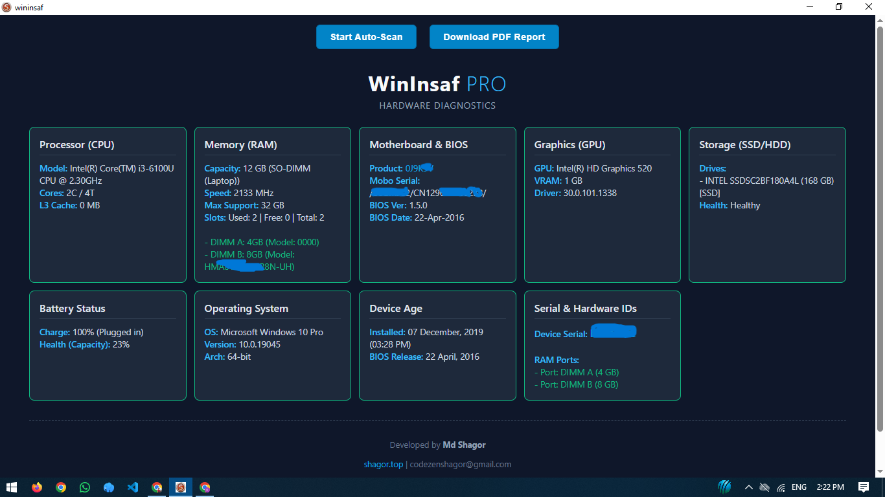

# 🖥 WinInsaf PRO – Hardware Diagnostics

WinInsaf PRO is a lightweight and professional Windows desktop application designed to provide complete hardware diagnostics in a single clean dashboard.

With one-click Auto Scan and PDF report generation, users can instantly analyze their system hardware information.

---

## 🚀 Features

- 🔍 One-Click Auto Scan
- 🧠 CPU Information (Model, Cores, Threads)
- 💾 RAM Details (Capacity, Speed, Slots)
- 🖥 GPU Information
- 💽 SSD / HDD Health Status
- 🔋 Battery Health Monitoring
- 🏷 Device Serial & Hardware IDs
- 📄 PDF Report Download
- ⚡ Fast & Lightweight
- 🔒 100% Offline – No Data Collection

---

## 🖥 System Requirements

- Windows 10 / 11 (64-bit)
- Minimum 2 GB RAM
- 20 MB Free Storage

---

## 📦 Installation

The installer files are available inside the `software/` folder.

You can install the application using **any one** of the following:

### Option 1 – EXE Installer (Recommended)
`software/wininsaf_0.1.0_x64-setup.exe`

✔ Easy setup wizard  
✔ Recommended for most users  

### Option 2 – MSI Installer
`software/wininsaf_0.1.0_x64_en-US.msi`

✔ Suitable for enterprise or advanced installations  
✔ Can be deployed via Windows Installer  

> You only need to install **one** of the above files.

---

## 📸 Screenshot

---

## 🔐 Privacy Policy

WinInsaf PRO does NOT collect, store, or transmit any personal user data.

All hardware information is processed locally on the user's device.  
No tracking. No analytics.

---

## 🛠 Version

Current Version: v0.1.0  
Architecture: x64  
Language: English (en-US)

---

## 👨‍💻 Developer

**Md Shagor**  
🌐 Website: https://shagor.top  
📧 Email: codezenshagor@gmail.com  

For any desktop application development, feel free to contact.

---

© 2026 WinInsaf PRO. All rights reserved.
